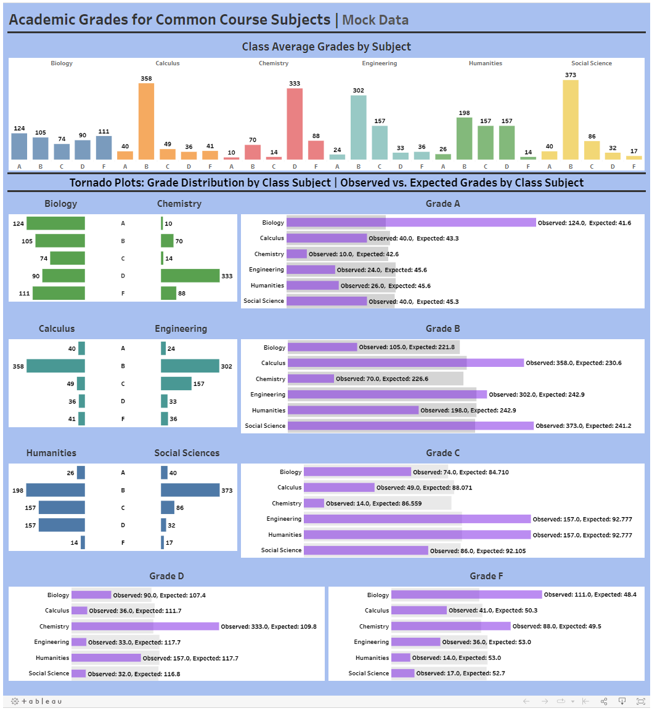

## Academic Grades Tableau Dashboard
This repository links to the Academic Grades Tableau dashboard. The mock data was generated by myself which is comprised of random grades and scores for some popular school subjects. Additionally, expected scores were calculated, which were used in observed and expected overlay bar charts. This style of visualization can tell the reader, where certain class performances are surpassing expectations and where some grades may be well below expectations. This could alert performance issues, instruction styles, etc. Tornado charts were used for other descriptive statistics. 

[Academic Grades by Kristi Bischoff](https://public.tableau.com/app/profile/kristi.bischoff/viz/AcademicGrades/Dashboard1)

